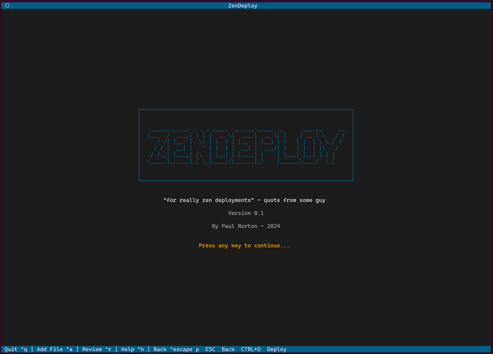
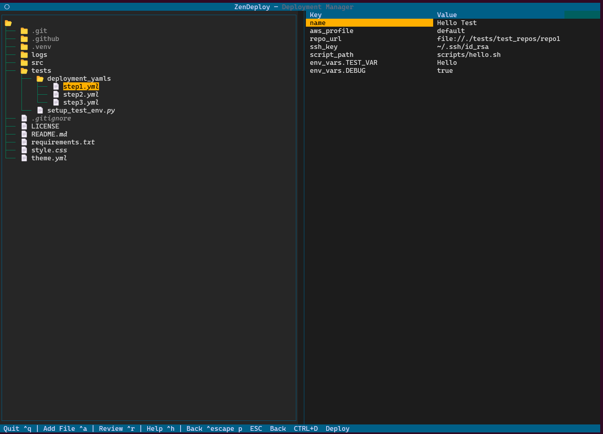
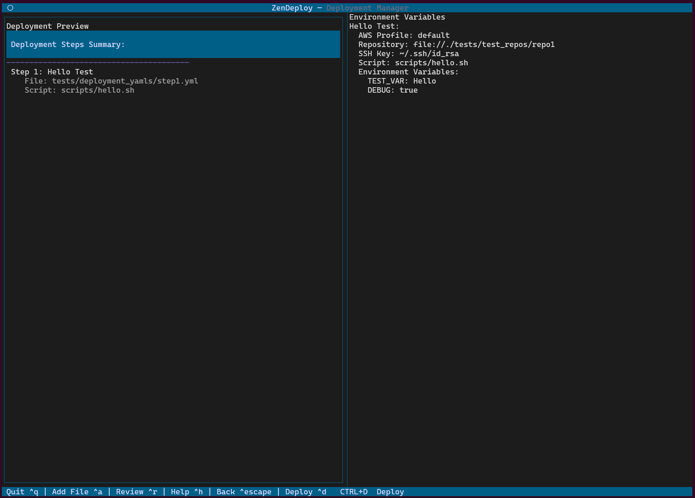
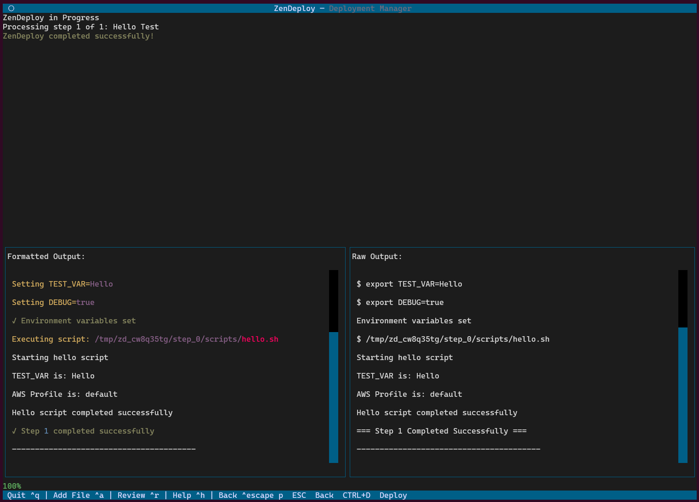

# ZenDeploy (ZD)

A Terminal User Interface (TUI) application for managing and executing AWS deployments through YAML configurations. ZenDeploy provides a streamlined way to manage deployment scripts, configure AWS environments, and execute deployments with real-time monitoring and comprehensive audit logging.


## Screenshots

| <br/><em>ZenDeploy Welcome Screen</em> | <br/><em>Main interface for deployment file selection</em> |
|:---:|:---:|
| <br/><em>Deployment review and configuration screen</em> | <br/><em>Deployment execution and progress monitoring</em> |


## Quick Start

1. Install dependencies:
```bash
git clone repo
```

2. Create a virtual environment:
   ```bash
   python3 -m venv .venv
   source .venv/bin/activate  # On Linux/macOS
   .venv\Scripts\activate     # On Windows
   ```

3. Install dependencies:
   ```bash
   pip install -r requirements.txt
   ```

4. Run App:
   ```bash
   python src/main.py
   ```
   
### Required Dependencies
- textual: Modern TUI framework for Python
- PyYAML: YAML file parsing and manipulation
- GitPython: Git repository operations
- pyfiglet: ASCII art generation
- rich: Rich text formatting
- typing: Type hints support

Project Structure:

zendeploy/
├── src/
│ ├── init.py
│ ├── main.py # Application entry point and TUI initialization
│ ├── deployment_manager.py # Handles deployment step management
│ ├── deployment_executor.py# Executes deployment steps
│ ├── review_screen.py # Review and execution screen
│ └── audit_logger.py # Audit logging functionality
├── logs/ # Directory for audit and deployment logs
├── requirements.txt # Project dependencies
├── theme.yml # Application theming configuration
└── README.md # This file


For detailed setup instructions, see the [Installation Guide](docs/installation.md).

## Documentation

- [Installation Guide](docs/installation.md) - Setup and requirements
- [Configuration Guide](docs/configuration.md) - YAML configuration and theming
- [Testing Guide](docs/testing.md) - Testing and development


